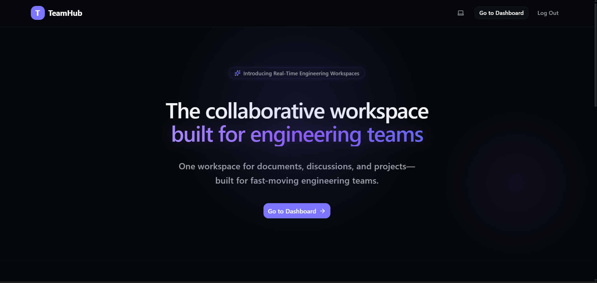
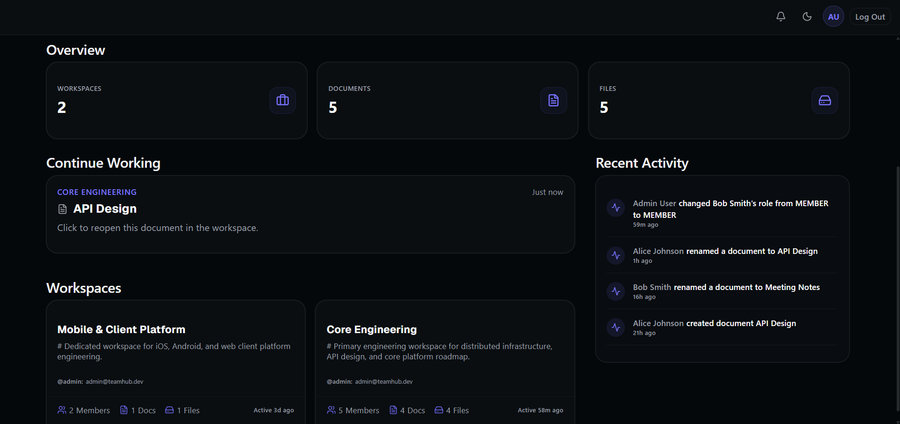
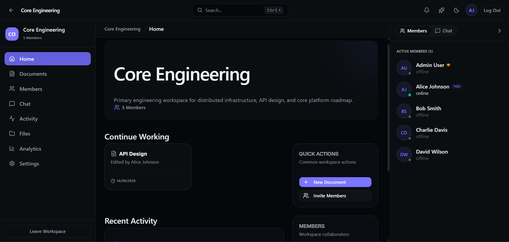
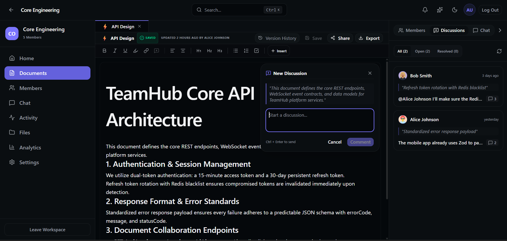
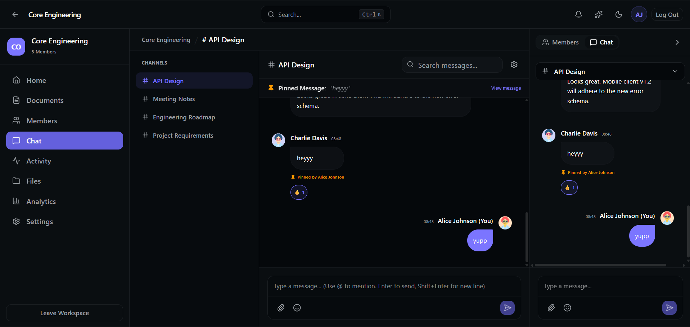

<div align="center">

# TeamHub

### A persistent collaborative workspace for engineering teams.

Real-time documents, team communication, shared context, and engineering workflows together inside one workspace.

<!-- Add TeamHub banner/logo here -->

<br />


<br />

**Real-Time Collaboration · CRDT Editing · Workspace Presence · Team Chat · Version History**

</div>

---

## Overview

**TeamHub** is a full-stack collaborative workspace that brings documentation, communication, and team context into one persistent environment.

Instead of distributing engineering knowledge across disconnected chat apps, document editors, file stores, and project tools, TeamHub keeps collaboration attached to the workspace where the work actually happens.

```text
            Documents + Real-Time Editing + Chat + Comments + Version History
                                          +
                           Presence + Notifications + Files
                                          │
                                          ▼
                                 Persistent Workspace
```
---

## Product Preview

### Landing Page

<p align="center">
  
</p>

### Workspace Experience

<table>
  <tr>
    <th>Dashboard</th>
    <th>Workspace Home</th>
  </tr>
  <tr>
    <td>
      
    </td>
    <td>
      
    </td>
  </tr>
</table>

### Collaborative Documents & Chat

<table>
  <tr>
    <th>Collaborative Documents</th>
    <th>Real-Time Chat</th>
  </tr>
  <tr>
    <td>
      
    </td>
    <td>
      
    </td>
  </tr>
</table>

---

## Why TeamHub?

Modern engineering work is fragmented across document editors, chat applications, project trackers, and file storage.

TeamHub explores a workspace-first model where collaboration, documentation, communication, and shared context remain connected in one persistent environment.

```text
                              Workspace
                                  │
               ┌──────────────────┼──────────────────┐
               │                  │                  │
               ▼                  ▼                  ▼
           Documents            Chat              Files
               │                  │                  │
               ├── Live Editing   ├── Messages       └── Shared Resources
               ├── Comments       ├── Unread State
               ├── Versions       └── Real-Time Sync
               └── Presence
                                  │
                                  ▼
                       Activity & Notifications
```
---

## Core Features

### ⚡ Real-Time Collaboration

- Multi-user collaborative editing with **Yjs CRDTs**
- Conflict-free concurrent document updates
- Live cursors, selections, and collaborator awareness
- Real-time synchronization through **Socket.IO**
- Persistent collaborative document state

### 🟢 Workspace Collaboration

- Workspace-scoped team communication
- Real-time member presence
- Shared files and resources
- Workspace activity feeds
- Workspace-scoped notifications
- Role-based workspace permissions

### 📄 Documents

- Rich collaborative documents
- Comments and threaded discussions
- Comment resolution
- Persistent version history
- Version comparison and restoration
- Author and revision metadata

### 💬 Chat

- Real-time workspace messaging
- Persistent message history
- Message editing and deletion
- Unread message tracking
- Reconnection-aware synchronization

### 🔐 Security & Isolation

- JWT-based authentication
- Workspace-scoped authorization
- Role-based permissions
- REST and WebSocket authorization
- Isolated workspace data boundaries

---

## Workspace Collaboration Model

TeamHub organizes collaboration around persistent workspaces. Each workspace acts as an isolated boundary for members, documents, communication, files, activity, and notifications.

```text
                                   User
                                     │
                                     ▼
                                Dashboard
                                     │
                       ┌─────────────┴─────────────┐
                       ▼                           ▼
                  Workspace A                  Workspace B
                       │
            ┌──────────┼──────────┬──────────┬──────────┐
            │          │          │          │          │
            ▼          ▼          ▼          ▼          ▼
        Documents    Members     Chat       Files     Activity
            │
            ├── Real-Time Editing
            ├── Collaboration Carets
            ├── Comments
            ├── Version History
            └── Document Awareness
                       │
                       ▼
             Notifications & Shared Context
```

A user may belong to multiple workspaces, but every workspace maintains its own membership boundary, collaborative resources, communication history, and authorization rules.

---

## Architecture

TeamHub separates persistent application state from real-time collaboration state.

```text
                    Client Application
              React + TypeScript + Yjs
                         │
             ┌───────────┴───────────┐
             │                       │
             ▼                       ▼
         REST API              WebSocket Events
             │                       │
             │                Socket.IO + Yjs
             │                       │
             └───────────┬───────────┘
                         ▼
                  Node.js Backend
                         │
             ┌───────────┴───────────┐
             │                       │
             ▼                       ▼
      PostgreSQL + Prisma       Upstash Redis
             │                       │
             ▼                       ▼
     Persistent Data       Distributed / Ephemeral
```

### Data Responsibilities

| System | Responsibility |
|---|---|
| **PostgreSQL** | Persistent application data |
| **Prisma** | Database access and schema management |
| **Yjs** | CRDT-based collaborative document state |
| **Socket.IO** | Real-time collaboration and workspace events |
| **TanStack Query** | Client-side server state and caching |
| **Upstash Redis** | Distributed and ephemeral infrastructure |

For detailed architecture decisions, module boundaries, and real-time lifecycle design, see [`docs/architecture.md`](./docs/architecture.md).

---

## Engineering Highlights

Rather than focusing only on features, TeamHub is designed around a set of architectural decisions that support real-time collaboration, workspace isolation, and scalable synchronization. The following highlights summarize some of the core engineering concepts behind the project.

### CRDT-Based Collaborative Editing

TeamHub uses **Yjs** CRDTs to merge concurrent document edits without relying on traditional last-write-wins conflict resolution. Multiple users can edit the same document simultaneously while maintaining a consistent shared state.

### Separate Presence and Document Awareness Models

TeamHub models workspace presence and document awareness as separate systems because they solve different collaboration problems:

- **Workspace presence** tracks which members are currently connected to a workspace.
- **Document awareness** tracks ephemeral collaboration state such as active editors, remote carets, selections, and typing state.

Keeping these concerns separate simplifies lifecycle management and prevents document-specific collaboration from becoming tightly coupled to general workspace connectivity.

### Server State and Real-Time Synchronization

**TanStack Query** manages cached server state on the client, while **Socket.IO** delivers time-sensitive collaboration events. Separating these responsibilities allows cached API data and real-time updates to work together without making the WebSocket layer responsible for all application state.

### Real-Time Lifecycle Management

TeamHub explicitly manages connection lifecycles across workspace and document rooms, including:

- Joining collaborative sessions.
- Navigating between workspaces and documents.
- Browser refreshes and tab closures.
- Unexpected socket disconnections.
- Removal of stale presence and awareness state.
- Broadcasting updated collaborator state to remaining clients.

### Workspace-Scoped Authorization

Every protected operation validates workspace membership before exposing resources or accepting updates. Authorization boundaries are enforced consistently across both REST endpoints and WebSocket events.

### Server State and Real-Time Synchronization

**TanStack Query** manages persistent server state on the client, while Socket.IO events update time-sensitive collaboration state. This allows the application to combine cached API data with real-time changes without making the WebSocket layer responsible for all application state.

### Persistent Collaborative Documents

Collaborative **Yjs** document state remains synchronized while users actively edit and is persisted when appropriate, allowing real-time collaboration to coexist with durable document storage.

### Distributed Infrastructure with Upstash

**Upstash Redis** and **Upstash Rate Limit** support distributed infrastructure such as notification workflows and API rate limiting, providing globally accessible state without requiring a self-managed Redis deployment.

---

## Technology Stack

| Layer | Technologies |
|---|---|
| **Frontend** | React, TypeScript, React Router |
| **Server State** | TanStack Query, Axios |
| **UI & Forms** | Tailwind CSS, shadcn/ui, React Hook Form, Zod |
| **Editor** | Tiptap |
| **Collaboration** | Yjs, Yjs Awareness, Tiptap Collaboration |
| **Backend** | Node.js, Express.js, TypeScript |
| **Database** | PostgreSQL, Prisma |
| **Real-Time** | Socket.IO |
| **Infrastructure** | Upstash Redis, Upstash Rate Limit |
| **Authentication** | JWT, HTTP-only cookies |

---

## Project Structure

```text
teamhub/
│
├── client/
│   └── src/
│       ├── features/
│       ├── shared/
│       └── ...
│
├── server/
│   └── src/
│       ├── app/
│       ├── config/
│       ├── events/
│       ├── features/
│       ├── middleware/
│       ├── utils/
│       ├── websocket/
│       └── ...
│
├── docs/
│   ├── architecture.md
│   ├── database.md
│   ├── flows.md
│   ├── api.md
│   ├── apiContracts.md
│   └── scaling.md
│
└── README.md
```

The codebase follows a **feature-oriented architecture**, allowing product domains such as workspaces, documents, collaboration, chat, comments, notifications, and version history to evolve independently.

---

## Documentation

Detailed technical documentation is maintained separately from the project overview.

| Document | Description |
|---|---|
| [`Architecture`](./docs/architecture.md) | System architecture, module boundaries, and real-time infrastructure |
| [`Database`](./docs/database.md) | Database models, relationships, indexes, and persistence |
| [`Flows`](./docs/flows.md) | Authentication, collaboration, presence, and application flows |
| [`API`](./docs/api.md) | REST and WebSocket API reference |
| [`API Contracts`](./docs/apiContracts.md) | Frontend/backend request and response contracts |
| [`Scaling`](./docs/scaling.md) | Scalability boundaries and future infrastructure strategy |

---

## Getting Started

### Prerequisites

- Node.js
- npm
- PostgreSQL
- Upstash account for Redis-backed infrastructure

### 1. Clone the Repository

```bash
git clone https://github.com/forest-whispers/TeamHub.git
cd teamhub
```

### 2. Install Dependencies

```bash
npm install-all
```

### 3. Configure Environment Variables

Create the required environment files:

```text
client/
└── .env

server/
└── .env
```

Refer to the example environment files in the repository for the required variables.

### 4. Apply Database Migrations

```bash
npx prisma format
npx prisma migrate dev
```

### 5. Start the Backend

```bash
cd server
npm run dev
```

### 6. Start the Frontend

```bash
cd client
npm run dev
```

---

## Current Status

> 🚧 **TeamHub is under active development.**

The current V1 focuses on:

- Real-time collaborative documents
- Workspace presence
- Team chat
- Comments and discussions
- Version history
- Notifications
- Shared files
- Workspace activity
- Authorization and infrastructure hardening

The README provides a high-level overview, while detailed technical documentation evolves alongside the implemented systems.

---

## Roadmap

Future exploration includes:

- 🎙️ WebRTC voice and video collaboration
- 🖥️ Interactive presentation mode
- 📊 Advanced workspace analytics
- 🌐 Horizontal real-time scaling
- 🔎 Unified workspace search
- 📴 Offline-first collaborative editing
- 🧠 AI-powered workspace intelligence
- 🔗 GitHub, Slack, Linear, and Jira integrations

---

## License

This project is licensed under the MIT License.

---

<div align="center">

### TeamHub

**Where documents, conversations, and team context stay together.**

</div>